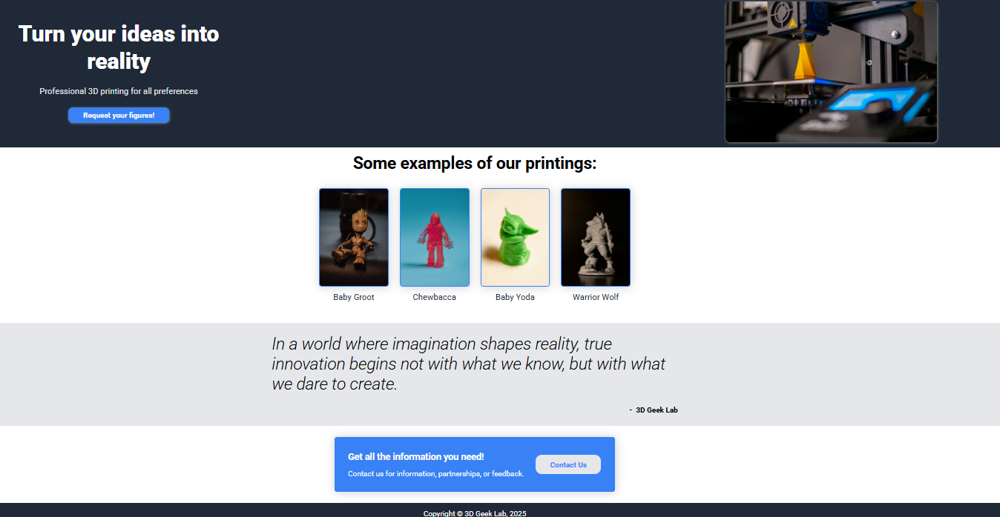

# 3D Geek Lab

Frontend do site **3D Geek Lab**, responsável por exibir a página principal, formulário de contato e enviar as mensagens para a API backend de forma segura via **reverse proxy da Vercel**.

---

## 🌐 Live URL

https://3d-geek-lab.vercel.app/

---

## 📄 Descrição

Este projeto implementa uma página de contato utilizando **HTML, CSS e JavaScript**, com foco em:

- simplicidade
- clareza de código
- boas práticas de integração frontend ↔ backend

O envio do formulário é feito de forma assíncrona (`fetch`) e o usuário recebe feedback visual durante o carregamento.

---

## 🔗 Integração com Backend

O frontend se comunica com a API backend através de um **reverse proxy configurado na Vercel**.

### Fluxo

``Browser → Vercel (/api/*) → Backend (Koyeb)``

---

## ⚙️ Tecnologias utilizadas

- HTML5
- CSS3
- JavaScript
- Fetch API
- Vercel (deploy + reverse proxy)

---

## 🔐 Segurança

---

- Nenhuma URL sensível de backend é exposta no código
- Nenhuma credencial é utilizada no frontend
- Comunicação feita via HTTPS em produção

---

## 👤 Autor

**David Cavalcanti**

Projeto desenvolvido para fins de estudo e portfólio.

---

## 🙏 Agradecimentos

**Obrigado por chegar até aqui!**

Este projeto faz parte do meu processo de aprendizado e evolução como desenvolvedor.
Qualquer feedback, sugestão, ou critica construtíva é muito bem-vindo.